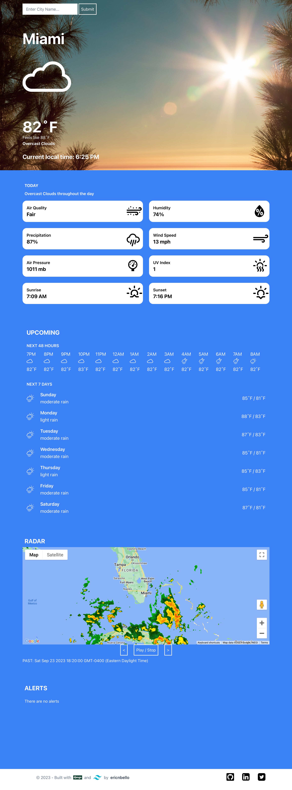

# Weather App

## Overview

The Weather App is a web application designed to provide users with accurate and up-to-date weather information. Built with Django, Python, and integrated with the OpenWeather API, this app offers a streamlined weather experience. Additionally, it incorporates the Google Maps API to display a radar map for visual weather insights.

## Technologies Used

### Django Framework

The project is developed using Django, a versatile web framework that simplifies web application development. Leveraging Django's capabilities, we created a seamless user interface for accessing weather data.

### Tailwind CSS

Tailwind CSS was employed for styling the application, allowing for rapid UI development. The utility-first approach of Tailwind CSS ensured an aesthetically pleasing and responsive design.

### Python

Python serves as the primary programming language for server-side logic and data processing. Its simplicity and robustness facilitated efficient development and seamless integration of various APIs.

### OpenWeather API

The Weather App relies on the OpenWeather API to provide reliable and real-time weather data. This API supplies accurate information about current conditions, forecasts, and more, ensuring users receive up-to-date weather updates.

### JavaScript

JavaScript enhances user interactivity on the client-side, enabling dynamic content updates without the need for page refreshes. This ensures a fluid and responsive user experience.

### Google Maps API

The Google Maps API is integrated to present a radar map, providing users with a visual representation of weather patterns and conditions in their area. This feature adds a valuable dimension to the app's functionality.

## Development Process

1. **Project Initialization**: The project was initiated using Django, laying a strong foundation for building the web application.

2. **UI Design with Tailwind CSS**: Tailwind CSS was chosen for its utility-first approach, enabling rapid prototyping and easy customization of UI elements.

3. **Backend Logic**: Django's capabilities were utilized to handle data processing and manage API calls effectively, ensuring seamless integration of weather data.

4. **OpenWeather API Integration**: The OpenWeather API was seamlessly integrated to fetch and display real-time weather data, providing users with accurate information.

5. **Radar Map with Google Maps API**: The Google Maps API was implemented to display a radar map, offering users a visual understanding of weather conditions in their area.

## Deployment

The Weather App is deployed on Heroku, a cloud platform simplifying the deployment, management, and scaling of web applications.

## Conclusion

The Weather App is a user-friendly web application that delivers accurate weather information in real-time. Its intuitive interface, powered by Django and Tailwind CSS, guarantees a smooth user experience. The integration of OpenWeather and Google Maps APIs enriches its functionality, making it a valuable tool for users seeking up-to-date weather insights.

